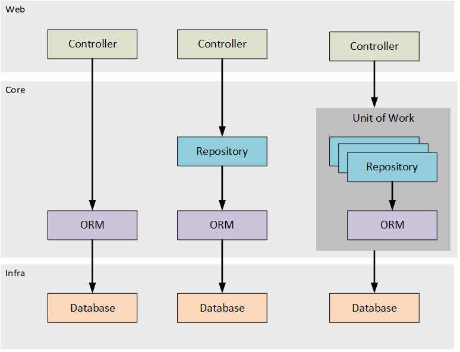

# Building a Unit of Work like pattern in NestJS.

## Introduction

Have you ever get that problem when working with the repo managing transaction across multiple repositories across
different aggregates or entities and one of them fails and you need to rollback all the changes? Well, I have and it`s
a pain in the ass to manage all that transactions across different providers and have to manually rollback them or make a 
compensation operation through them.

One of the most used techniques to solve this problem is the `Unit of Work` pattern which aims to centralize the database transaction
in one dependency which will which will orchestrate the queries through the repositories and whenever one of the repositories receives an error
we can then rollback all the changes in our database.

## Unit of Work



## Scenario

In the scenario below we have some models which is the Product and Purchase model. The service will create a purchase
but before the purchase is created we will need to check the stock of the product used in the purchase, if there is stock
for the requested product we will create the purchase and subtract from the stock amount.

```typescript
@Injectable()
export class ProductRepository {
  constructor(private readonly productModel: typeof ProductModel) {}

  async create(product: ProductModel): Promise<ProductModel> {
    return this.productModel.create({ product });
  }

  async findAll(): Promise<ProductModel[]> {
    return this.productModel.findAll();
  }

  async findOne(id: number): Promise<ProductModel> {
    return this.productModel.findByPk(id);
  }

  async update(id: number, product: ProductModel) {
    return this.productModel.update(product, { where: { id } });
  }

  async remove(id: number): Promise<number> {
    return this.productModel.destroy({ where: { id } });
  }
}
```

```typescript

@Injectable()
export class PurchaseRepository {
  constructor(private readonly purchaseModel: typeof PurchaseModel) {}

  async create(purchase: PurchaseModel): Promise<PurchaseModel> {
    return this.purchaseModel.create({ purchase });
  }

  async findAll(): Promise<PurchaseModel[]> {
    return this.purchaseModel.findAll();
  }

  async findOne(id: number): Promise<PurchaseModel> {
    return this.purchaseModel.findByPk(id);
  }

  async update(id: number, purchase: PurchaseModel) {
    return this.purchaseModel.update(purchase, { where: { id } });
  }

  async remove(id: number): Promise<number> {
    return this.purchaseModel.destroy({ where: { id } });
  }
}
```

```typescript
@Injectable()
export class PurchaseService {
  constructor(
    private readonly purchaseRepository: PurchaseRepository,
    private readonly productRepository: ProductRepository,
  ) {}

  async create(createPurchaseDto: CreatePurchaseDto) {
    const product = await this.productRepository.findOne(
      createPurchaseDto.productId,
    );
    if (product.stock < createPurchaseDto.quantity) {
      throw new Error('Insufficient stock');
    }
    product.stock -= createPurchaseDto.quantity;
    await this.productRepository.update(product.id, product);

    const purchase = new PurchaseModel();

    purchase.date = new Date();
    purchase.productId = product.id;
    purchase.quantity = createPurchaseDto.quantity;

    return this.purchaseRepository.create(purchase);
  }
}
```

So what is the problem with this code? Well, if the purchase creation fails we will have a stock inconsistency in our database
and we will need to rollback the changes made in the product repository. This is where the Unit of Work pattern comes in.

The unit of work pattern will be responsible for managing the transaction across the repositories and will rollback the changes
if one of the repositories fails.

## Implementing the Unit of Work pattern

So let's implement the Unit of Work pattern in our code.

```typescript
@Injectable({ scope: Scope.REQUEST })
export class UnitOfWork {
  transaction?: Transaction;

  constructor(
    @Inject(forwardRef(() => ProductRepository))
    public readonly productRepository: ProductRepository,
    @Inject(forwardRef(() => PurchaseRepository))
    public readonly purchaseRepository: PurchaseRepository,
    @Inject('SEQUELIZE')
    private readonly sequelize: Sequelize,
  ) {}

  async startTransaction() {
    this.transaction = await this.sequelize.transaction();
  }

  async commit() {
    await this.transaction.commit();
  }

  async rollback() {
    await this.transaction.rollback();
  }
}
```

This implementation is an adaptation to Martin Fowler's Unit of Work pattern. The `UnitOfWork` class will be responsible for managing the transaction.

After that we can update our implementation of the repositories just like the below code.

```typescript

@Injectable()
export class PurchaseRepository {
  constructor(
    @Inject(forwardRef(() => UnitOfWork))
    private readonly unitOfWork: UnitOfWork,
    private readonly purchaseModel: typeof PurchaseModel,
  ) {}

  async create(purchase: PurchaseModel): Promise<PurchaseModel> {
    return this.purchaseModel.create(
      { purchase },
      { transaction: this.unitOfWork.transaction },
    );
  }

  async findAll(): Promise<PurchaseModel[]> {
    return this.purchaseModel.findAll({
      transaction: this.unitOfWork.transaction,
    });
  }

  async findOne(id: number): Promise<PurchaseModel> {
    return this.purchaseModel.findByPk(id, {
      transaction: this.unitOfWork.transaction,
    });
  }

  async update(id: number, purchase: PurchaseModel) {
    return this.purchaseModel.update(purchase, {
      where: { id },
      transaction: this.unitOfWork.transaction,
    });
  }

  async remove(id: number): Promise<number> {
    return this.purchaseModel.destroy({
      where: { id },
      transaction: this.unitOfWork.transaction,
    });
  }
}
```

With that we can start the transaction in the unit of work provider and share it through all the repositories since
they expect it`s transaction in the options object. By that we can improve our service code and finally have a transaction.

```typescript

@Injectable()
export class PurchaseService {
  constructor(private readonly uom: UnitOfWork) {}

  async create(createPurchaseDto: CreatePurchaseDto) {
    await this.uom.startTransaction();

    try {
      const product = await this.uom.productRepository.findOne(
        createPurchaseDto.productId,
      );
      if (product.stock < createPurchaseDto.quantity) {
        throw new Error('Insufficient stock');
      }
      product.stock -= createPurchaseDto.quantity;
      await this.uom.productRepository.update(product.id, product);

      const purchase = new PurchaseModel();

      purchase.productId = product.id;
      purchase.quantity = createPurchaseDto.quantity;

      return this.uom.purchaseRepository.create(purchase);
    } catch (error) {
      await this.uom.rollback();
      throw error;
    }
  }
}
```

The `Unit of Work` must have all the repositories and act as a middleware between the repositories and the service layer.
By that if anything goes wrong in the service layer we can rollback all the changes made in the repositories.

Thats all for today folks. I hope you enjoyed this article and learned something new. If you have any questions or suggestions 
please let me know in the comments below.

You can se the code in the following repository: [nestjs-unit-of-work](https://github.com/murilogervasio/nestjs-sequelize-unit-of-work)
